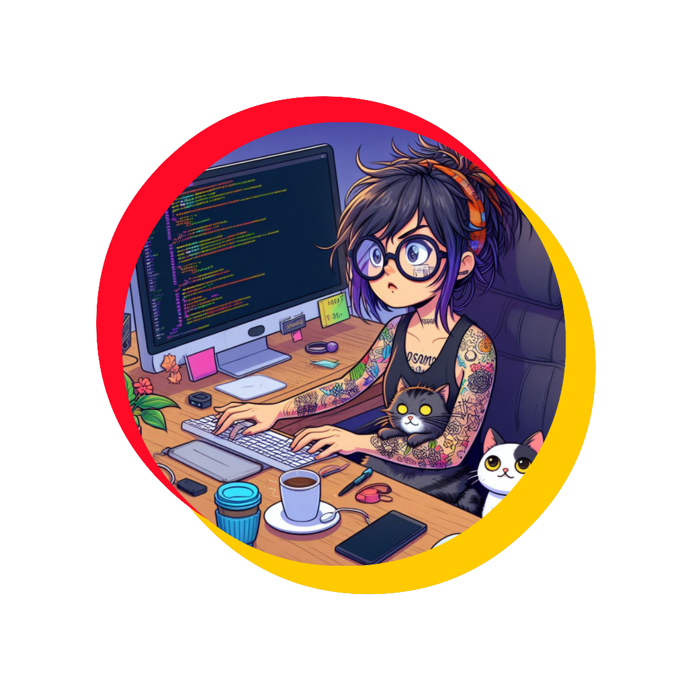
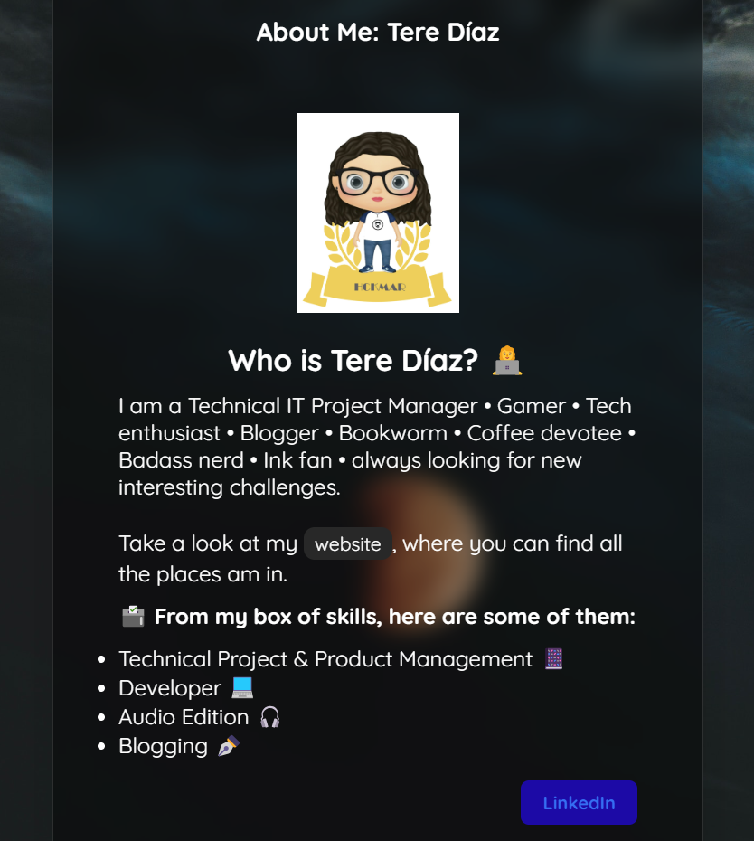

<!-- PROJECT LOGO -->
 

  

  <h3 align="center">Tere Díaz Personal Website</h3>

  

    Adding a mix of about me site and my website because why not?
     
    <a href="https://terediaz.site" target="_blank">View Site</a>
  

<!-- ABOUT THE PROJECT -->
## About The Project

  

Lorem ipsum dolor sit amet, consectetur adipiscing elit, sed do eiusmod tempor incididunt ut labore et dolore magna aliqua. Ut enim ad minim veniam, quis nostrud exercitation ullamco laboris nisi ut aliquip ex ea commodo consequat. Duis aute irure dolor in reprehenderit in voluptate velit esse cillum dolore eu fugiat nulla pariatur. Excepteur sint occaecat cupidatat non proident, sunt in culpa qui officia deserunt mollit anim id est laborum.

(<a href="#readme-top">back to top</a>)

<!-- ROADMAP -->
## Roadmap

* [x] Create the card view as about me site
* [x] Add README structure
* [ ] Create main site
* [ ] Document process

<!-- LICENSE -->
## License

Distributed under the MIT License. See `LICENSE.txt` for more information.

<!-- CONTACT -->
## Contact

Tere Díaz - [@hckmar](https://twitter.com/hckmar)

Project Link: [https://github.com/Hckmar9/terediaz](https://github.com/Hckmar9/terediaz)

(<a href="#readme-top">back to top</a>)
